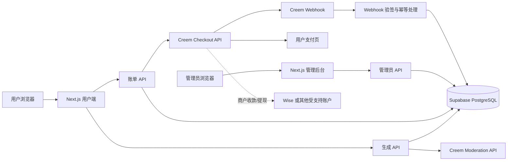
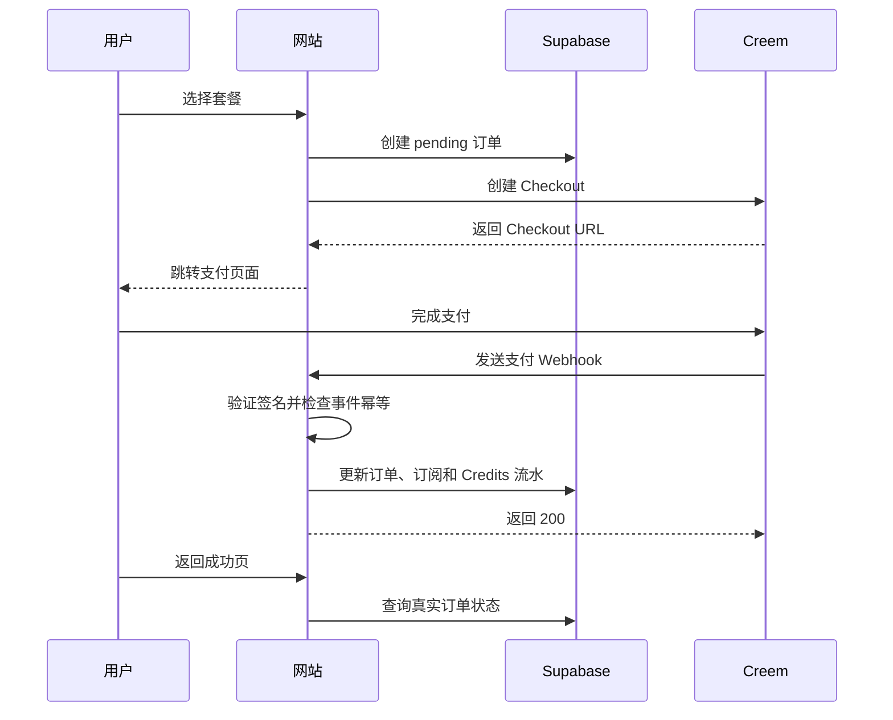
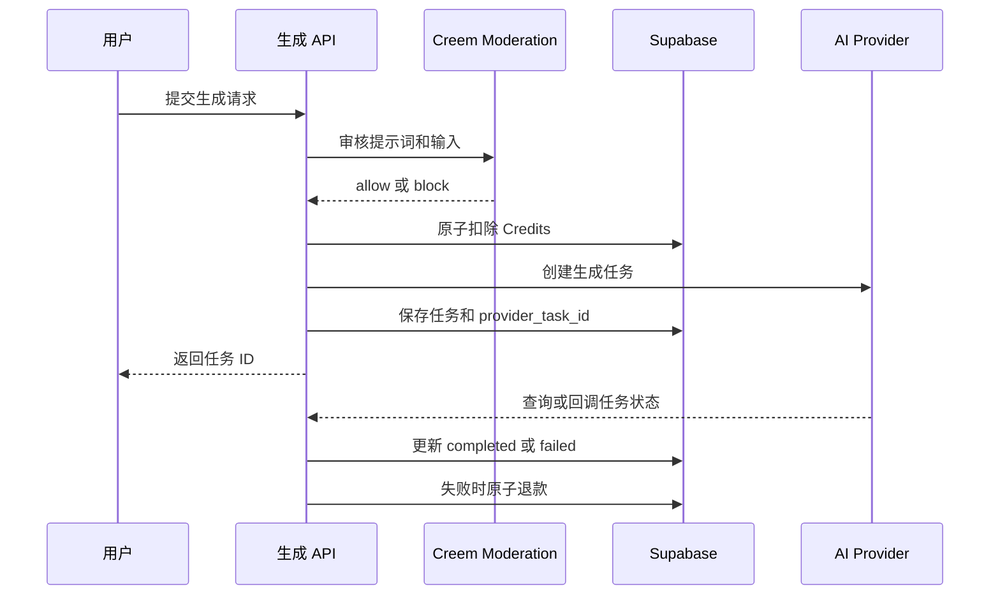

# AI Video Platform 管理后台与支付系统设计文档

## 1. 文档信息

| 项目 | 内容 |
|---|---|
| 文档名称 | 管理后台与支付系统总设计文档 |
| 当前版本 | v0.1.0 |
| 文档状态 | 初稿，待评审 |
| 适用项目 | `ai-video-platform` |
| 目标环境 | Vercel + Supabase + Creem |
| 支付提现 | Creem 收款，Wise 作为商户收款账户或提现渠道（需以两家平台实际支持为准） |

## 2. 版本记录

| 版本 | 日期 | 说明 |
|---|---|---|
| v0.1.0 | 2026-07-28 | 初始设计：管理后台、Creem 支付、Credits、订单和分阶段实施计划 |

## 3. 项目现状

### 3.1 已有能力

- Supabase Auth 用户登录。
- `profiles` 用户资料和 Credits 余额。
- `models` 模型配置表，并支持读取启用模型。
- `generation_tasks` 生成任务表。
- `credit_transactions` Credits 流水表。
- `consume_credits` 和 `refund_credits` 数据库函数。
- 图片和视频生成前的 Creem Moderation API 审核。
- 生成失败后的 Credits 退款逻辑。
- `/pricing` 价格展示页面。

### 3.2 当前缺口

- 没有管理员角色和管理员登录入口。
- 没有管理员后台页面。
- 没有 Creem Checkout 创建接口。
- 没有 Creem 支付 Webhook 接口和签名校验。
- 没有支付订单、订阅和退款数据表。
- `/pricing` 中的订阅按钮目前只跳转到登录页。
- 没有购买成功后自动发放 Credits 的流程。
- 没有管理员手动充值、退款和订单查询功能。
- 现有账户页部分展示数据仍为演示数据，不能作为正式账务页面。

### 3.3 设计结论

支付正式上线前，必须先完成支付订单、Webhook、Credits 发放和管理员最小后台。生成任务已经有 Credits 扣除能力，但这不等于支付系统已经完成。

## 4. 建设目标

### 4.1 业务目标

1. 用户可以安全购买订阅或 Credits 套餐。
2. Creem 支付结果可以可靠同步到网站。
3. 支付成功后自动发放订阅权益和 Credits。
4. 管理员可以查询用户、订单、退款和生成任务。
5. 管理员可以手动调整 Credits，但所有调整都可追溯。
6. 模型价格、启用状态和供应商配置可以在后台维护。
7. 支付失败、回调重复、生成失败和退款等异常情况不会造成账务重复或 Credits 丢失。

### 4.2 非目标

- 第一阶段不开发独立的多租户企业组织系统。
- 第一阶段不开发 Wise API 自动打款功能。
- 第一阶段不在网站内处理商户收款账户的提现。
- 第一阶段不允许前端直接修改用户余额、订单状态或退款状态。

## 5. 总体架构



### 5.1 系统边界

| 系统 | 负责内容 |
|---|---|
| Next.js | 用户页面、管理员页面、服务端 API |
| Supabase Auth | 用户和管理员身份认证 |
| Supabase PostgreSQL | 用户、订单、订阅、Credits、模型和审计数据 |
| Creem | Checkout、支付、订阅、退款和支付事件 |
| Creem Moderation | 生成内容审核，不负责支付 |
| AI Provider | 实际图片、视频和音频生成 |
| Wise | 商户资金接收或提现，具体可用性由 Creem 与 Wise 账户条件决定 |

## 6. 角色与权限

### 6.1 角色

| 角色 | 权限 |
|---|---|
| `owner` | 全部后台权限，包括管理员和支付配置管理 |
| `admin` | 用户、订单、Credits、模型和任务管理 |
| `support` | 查看用户、订单和任务；可提交充值或退款申请，不可直接修改支付状态 |
| 普通用户 | 只能访问自己的账户、订单、Credits 流水和生成任务 |

### 6.2 权限原则

- 管理员权限必须在服务端校验，不能只依赖前端隐藏菜单。
- `SUPABASE_SERVICE_ROLE_KEY` 只能在服务端使用，不能返回浏览器。
- 手动充值、退款、改价、停用模型等操作必须记录审计日志。
- 退款和余额调整应支持二次确认；金额较大时可要求 `owner` 审批。
- 管理员 API 默认禁止普通用户访问。

## 7. 核心业务流程

### 7.1 用户购买流程



支付成功页只能展示状态，不能直接给用户增加 Credits。Credits 必须以经过验签的 Creem Webhook 为准。

### 7.2 生成与 Credits 流程



审核失败、审核服务不可用时，不得扣除 Credits，也不得调用模型供应商。

### 7.3 管理员手动充值

1. 管理员搜索用户并打开账户详情。
2. 输入正数 Credits、业务原因和外部凭证号。
3. 服务端校验权限、金额范围和幂等键。
4. 在数据库事务中更新余额并写入 `credit_transactions`。
5. 写入 `admin_audit_logs`。
6. 页面展示调整前余额、调整后余额和操作人。

手动充值不能直接执行裸 `UPDATE profiles SET credits_remaining = ...`，必须通过服务端受控接口或数据库安全函数完成。

### 7.4 退款流程

1. 管理员打开订单详情。
2. 查看订单金额、支付状态、已发放 Credits 和历史退款。
3. 创建退款申请，填写原因和退款金额。
4. 服务端检查订单状态、累计退款金额和重复操作。
5. 调用 Creem 退款接口；如果当前 Creem 账户或接口不支持自动退款，则标记为“待人工在 Creem 处理”。
6. 以 Creem 退款事件或管理员确认结果更新订单。
7. 按业务规则撤销未使用权益或扣回未使用 Credits，并记录流水。

退款不能只在本地标记成功。外部支付退款和站内 Credits 回收必须分别记录状态。

## 8. 功能设计

### 8.1 用户端账单功能

- 价格页展示月付、年付和一次性 Credits 套餐。
- 已登录用户点击购买后创建 Checkout。
- 未登录用户先登录，再回到原套餐。
- 支付成功页显示“支付处理中、支付成功、支付失败”三种状态。
- 账户页展示当前套餐、下次续费时间、Credits 余额和账单记录。
- 支持查看订单详情和退款政策。

### 8.2 管理后台首页

- 今日订单数和收入。
- 待处理退款数。
- 支付回调失败数。
- 活跃用户数。
- Credits 发放、消耗和退款统计。
- 生成成功率、失败率和供应商错误率。
- 审核拦截数量。

### 8.3 用户管理

- 按邮箱、用户 ID、用户名搜索。
- 查看账户状态、套餐、Credits 余额和注册时间。
- 查看订单、Credits 流水和生成任务。
- 禁用或恢复账户。
- 手动充值、扣除或赠送 Credits。
- 标记内部备注，但不在用户端暴露管理员备注。

### 8.4 订单管理

- 按订单号、用户、Creem 订单号、状态和时间筛选。
- 状态包括：`pending`、`paid`、`failed`、`refunding`、`refunded`、`partially_refunded`、`cancelled`。
- 展示套餐、金额、币种、支付时间、Creem 客户信息和回调状态。
- 查看关联的订阅、Credits 流水和退款记录。
- 支持重新处理失败 Webhook，但必须以事件 ID 做幂等保护。

### 8.5 模型管理

- 模型名称、模型 ID、类型和供应商。
- 启用或停用模型。
- 单次生成 Credits 消耗。
- 支持的分辨率、时长、比例和输入类型。
- 供应商健康状态和最近错误。
- 前台显示名称、描述和排序权重。

模型管理修改后，生成 API 仍需在服务端重新读取和校验，不能相信浏览器传来的 Credits 价格。

### 8.6 任务与内容审核

- 按用户、模型、状态、时间筛选生成任务。
- 查看失败原因、供应商任务 ID 和重试次数。
- 手动重试可重试任务。
- 查看审核结果：`allow`、`block`、`unavailable`、`error`。
- 记录审核失败时是否已扣费，避免重复退款。
- 对高风险内容保留必要的审计信息，避免在后台无保护地展示敏感内容。

### 8.7 常用运营功能

- 套餐上下架和价格版本管理。
- 优惠券和限时活动。
- 新用户赠送 Credits。
- 公告和维护通知。
- 低余额邮件提醒。
- 支付失败提醒。
- 用户反馈和客服工单。
- 供应商余额或 API 健康检查。

## 9. 数据库设计

### 9.1 管理员角色表

```sql
admin_roles
- id UUID PRIMARY KEY
- user_id UUID NOT NULL REFERENCES auth.users(id)
- role TEXT NOT NULL CHECK (role IN ('owner', 'admin', 'support'))
- created_at TIMESTAMPTZ NOT NULL DEFAULT NOW()
- created_by UUID REFERENCES auth.users(id)
```

约束：`user_id` 唯一；只有 `owner` 可以修改管理员角色。

### 9.2 套餐表

```sql
billing_plans
- id TEXT PRIMARY KEY
- name TEXT NOT NULL
- billing_type TEXT NOT NULL CHECK (billing_type IN ('subscription', 'credit_pack'))
- interval TEXT CHECK (interval IN ('month', 'year', 'one_time'))
- price_amount INTEGER NOT NULL
- currency TEXT NOT NULL DEFAULT 'USD'
- credits_amount INTEGER NOT NULL DEFAULT 0
- creem_product_id TEXT
- is_active BOOLEAN NOT NULL DEFAULT true
- metadata JSONB NOT NULL DEFAULT '{}'
- created_at TIMESTAMPTZ NOT NULL DEFAULT NOW()
- updated_at TIMESTAMPTZ NOT NULL DEFAULT NOW()
```

金额统一使用最小货币单位保存，例如美元分，避免浮点误差。

### 9.3 支付订单表

```sql
payment_orders
- id UUID PRIMARY KEY
- user_id UUID NOT NULL REFERENCES profiles(id)
- plan_id TEXT REFERENCES billing_plans(id)
- creem_order_id TEXT UNIQUE
- creem_checkout_id TEXT UNIQUE
- status TEXT NOT NULL
- amount INTEGER NOT NULL
- currency TEXT NOT NULL
- credits_granted INTEGER NOT NULL DEFAULT 0
- idempotency_key TEXT UNIQUE
- paid_at TIMESTAMPTZ
- created_at TIMESTAMPTZ NOT NULL DEFAULT NOW()
- updated_at TIMESTAMPTZ NOT NULL DEFAULT NOW()
```

### 9.4 订阅表

```sql
subscriptions
- id UUID PRIMARY KEY
- user_id UUID NOT NULL REFERENCES profiles(id)
- plan_id TEXT NOT NULL REFERENCES billing_plans(id)
- creem_subscription_id TEXT UNIQUE NOT NULL
- status TEXT NOT NULL
- current_period_start TIMESTAMPTZ
- current_period_end TIMESTAMPTZ
- cancel_at_period_end BOOLEAN NOT NULL DEFAULT false
- cancelled_at TIMESTAMPTZ
- created_at TIMESTAMPTZ NOT NULL DEFAULT NOW()
- updated_at TIMESTAMPTZ NOT NULL DEFAULT NOW()
```

### 9.5 支付事件表

```sql
payment_events
- id UUID PRIMARY KEY
- provider TEXT NOT NULL DEFAULT 'creem'
- event_id TEXT NOT NULL
- event_type TEXT NOT NULL
- payload JSONB NOT NULL
- process_status TEXT NOT NULL DEFAULT 'received'
- process_error TEXT
- processed_at TIMESTAMPTZ
- created_at TIMESTAMPTZ NOT NULL DEFAULT NOW()
```

约束：`provider + event_id` 唯一，保证 Webhook 重复投递不会重复发放 Credits。

### 9.6 退款表

```sql
refunds
- id UUID PRIMARY KEY
- order_id UUID NOT NULL REFERENCES payment_orders(id)
- user_id UUID NOT NULL REFERENCES profiles(id)
- creem_refund_id TEXT UNIQUE
- amount INTEGER NOT NULL
- currency TEXT NOT NULL
- status TEXT NOT NULL
- reason TEXT
- requested_by UUID REFERENCES auth.users(id)
- approved_by UUID REFERENCES auth.users(id)
- created_at TIMESTAMPTZ NOT NULL DEFAULT NOW()
- completed_at TIMESTAMPTZ
```

### 9.7 管理员审计日志

```sql
admin_audit_logs
- id UUID PRIMARY KEY
- actor_id UUID NOT NULL REFERENCES auth.users(id)
- action TEXT NOT NULL
- target_type TEXT NOT NULL
- target_id TEXT
- before_data JSONB
- after_data JSONB
- reason TEXT
- request_id TEXT
- created_at TIMESTAMPTZ NOT NULL DEFAULT NOW()
```

### 9.8 现有表的调整

- `credit_transactions.source` 增加 `manual_adjustment`、`purchase_reversal` 等必要来源。
- `credit_transactions` 增加幂等引用约束或唯一业务键，避免同一订单重复发放。
- `profiles` 增加正式的账户状态字段，替代仅依赖前端演示数据。
- `models` 增加 `credits_cost`、`sort_order`、`admin_notes` 或等价配置字段。
- 所有新增表增加 RLS；管理员读写使用服务端权限和角色校验。

## 10. 接口设计

### 10.1 用户账单接口

| 方法 | 路径 | 说明 |
|---|---|---|
| `GET` | `/api/billing/plans` | 获取启用套餐 |
| `POST` | `/api/billing/checkout` | 创建 Creem Checkout |
| `GET` | `/api/billing/orders` | 获取当前用户订单 |
| `GET` | `/api/billing/orders/:id` | 获取订单详情 |
| `GET` | `/api/billing/subscription` | 获取当前订阅 |
| `POST` | `/api/billing/subscription/cancel` | 申请期末取消订阅 |

### 10.2 Creem 回调接口

| 方法 | 路径 | 说明 |
|---|---|---|
| `POST` | `/api/webhooks/creem` | 接收支付、订阅和退款事件 |

处理要求：

1. 读取原始请求体进行签名验证。
2. 验证事件来源和时间窗口。
3. 用 `provider + event_id` 做幂等判断。
4. 先保存原始事件，再执行业务处理。
5. 数据库事务内更新订单、订阅和 Credits 流水。
6. 已处理事件重复到达时返回 200，不重复发放权益。
7. 处理失败时记录错误并支持后台重试。

Creem 具体事件名称、签名算法、Checkout 参数和退款接口字段必须以当前 Creem 官方文档及商户账户实际权限为准，开发前需要完成一次接口确认，不能凭猜测实现。

### 10.3 管理后台接口

| 方法 | 路径 | 说明 |
|---|---|---|
| `GET` | `/api/admin/overview` | 管理数据概览 |
| `GET` | `/api/admin/users` | 用户列表和筛选 |
| `GET` | `/api/admin/users/:id` | 用户详情 |
| `POST` | `/api/admin/users/:id/credits` | 手动调整 Credits |
| `GET` | `/api/admin/orders` | 订单列表 |
| `POST` | `/api/admin/orders/:id/refund` | 创建退款申请 |
| `POST` | `/api/admin/payment-events/:id/retry` | 重试支付事件 |
| `GET` | `/api/admin/tasks` | 生成任务列表 |
| `POST` | `/api/admin/tasks/:id/retry` | 重试生成任务 |
| `GET` | `/api/admin/models` | 模型管理列表 |
| `PATCH` | `/api/admin/models/:id` | 修改模型配置 |
| `GET` | `/api/admin/audit-logs` | 审计日志 |

所有 `/api/admin/*` 接口必须统一经过管理员权限中间件或服务端权限函数，不能在每个接口中复制不一致的权限逻辑。

## 11. 页面结构

```text
/admin
├── /overview              数据概览
├── /users                 用户管理
│   └── /[id]              用户详情、Credits、订单、任务
├── /orders                订单管理
├── /refunds               退款管理
├── /payment-events        支付回调和失败事件
├── /models                模型管理
├── /tasks                 生成任务和失败重试
├── /plans                 套餐、价格和 Credits 配置
├── /announcements         公告管理
├── /audit-logs            管理员操作日志
└── /settings              后台设置
```

## 12. 安全设计

- 管理员后台默认不公开展示，未授权用户统一返回 401 或 403。
- 支付 Webhook 使用 Creem 官方签名机制验证，禁止只检查任意请求头是否存在。
- Webhook 原始 payload 脱敏存储，不能保存不必要的支付敏感数据。
- 不在日志中输出 API Key、完整支付卡信息或完整用户认证令牌。
- Credits 变更使用数据库事务和幂等键。
- 所有金额、币种和订单状态由服务端确认，不能相信浏览器提交的价格。
- 管理员敏感操作增加 CSRF、防重复提交和速率限制。
- 退款、手动扣除和大额充值保留审计记录。
- 管理员账号建议启用 MFA，并限制高权限账号数量。
- 用户生成内容和审核记录按最小权限展示，避免后台泄露敏感内容。

## 13. 异常与幂等策略

| 场景 | 处理方式 |
|---|---|
| Checkout 创建成功但本地订单保存失败 | 使用幂等键重试查询或补写订单 |
| 用户支付成功但 Webhook 延迟 | 成功页显示处理中，后台以 Webhook 为准 |
| Webhook 重复 | 通过事件 ID 唯一约束直接忽略重复业务处理 |
| Webhook 处理失败 | 保存错误、返回可重试状态、后台支持手动重试 |
| 支付成功但 Credits 发放失败 | 订单标记为待补偿，不允许重复创建新订单 |
| Creem 退款成功但回调延迟 | 订单和退款保持处理中，等待事件或管理员核验 |
| 生成任务失败 | 原子退款并写入退款流水 |
| 管理员重复点击充值 | 使用请求幂等键，重复请求返回原结果 |
| 模型被停用后仍有旧页面请求 | 服务端重新检查 `is_active` 并拒绝新任务 |

## 14. 性能与容量预估

首版管理后台属于低频后台系统，预计主要瓶颈不在管理页面，而在支付回调和生成任务轮询。

- 管理接口目标：普通查询 P95 小于 500ms。
- 订单和用户列表必须分页，默认每页 20 或 50 条。
- 支付事件按 `provider + event_id` 建唯一索引。
- 订单、支付事件、Credits 流水和生成任务按时间字段建立索引。
- Webhook 处理应快速返回，重任务可拆成异步重试；首版可先使用数据库状态和后台重试。
- 不在管理首页一次性加载全部任务、订单或日志。
- 日志和支付 payload 需要考虑保存周期与脱敏策略。

## 15. 分阶段实施计划

### 阶段 0：接口和业务确认

目标：在写支付代码前消除关键不确定性。

- 确认 Creem 当前账户支持的产品、Checkout、订阅、Webhook 和退款能力。
- 确认使用订阅、一次性 Credits 包，或两者同时使用。
- 确认币种、价格、税费、退款政策和 Credits 发放规则。
- 确认 Creem 是否接受当前 Wise 账户作为收款或提现账户。
- 确认管理员账号、角色和首位 `owner`。

交付物：支付接口确认记录、套餐清单、退款规则、账户收款路径。

### 阶段 1：管理后台基础

目标：具备安全的管理员入口和只读运维能力。

- 创建管理员角色表和权限校验函数。
- 创建 `/admin` 布局、登录保护和基础导航。
- 实现数据概览、用户列表、用户详情和任务列表。
- 接入真实账户数据，移除账户页演示数据。
- 建立审计日志表和统一记录函数。

验收标准：非管理员无法访问后台；管理员可以查看用户、余额、任务和流水；所有后台访问经过服务端授权。

### 阶段 2：Creem 支付核心链路

目标：用户可以完成一次真实支付，并自动获得权益。

- 创建套餐表和支付订单表。
- 实现 `/api/billing/plans` 和 `/api/billing/checkout`。
- 实现 `/api/webhooks/creem`。
- 完成签名校验、事件存储和幂等处理。
- 支付成功后发放 Credits 或创建订阅。
- 增加订单列表、订单详情和支付成功状态页。
- 使用 Creem 测试环境完成正向、重复回调和失败回调测试。

验收标准：同一个支付事件重复发送不会重复发放 Credits；支付成功页不依赖前端参数发放权益；订单状态与 Creem 事件可追溯。

### 阶段 3：充值、退款和对账

目标：管理员可以处理日常客服和财务操作。

- 实现手动充值、手动扣除和赠送 Credits。
- 实现订单筛选、退款申请和退款状态。
- 接入 Creem 退款接口；若接口暂不可用，提供人工退款登记流程。
- 增加支付事件失败重试。
- 增加订单、退款和 Credits 流水的对账视图。
- 增加管理员操作日志和大额操作二次确认。

验收标准：任意余额变化都能追溯到订单、生成任务或管理员操作；退款不会重复扣除或重复返还。

### 阶段 4：模型和任务运营管理

目标：不改代码即可维护可用模型和处理常见生成问题。

- 实现模型启用/停用、价格和排序管理。
- 实现模型参数和能力配置。
- 实现失败任务重试和失败退款检查。
- 增加供应商健康状态和错误统计。
- 增加审核记录和异常请求统计。

验收标准：停用模型后新请求立即被服务端拒绝；模型价格以服务端配置为准；任务重试和退款保持幂等。

### 阶段 5：运营和安全增强

目标：提升日常运营效率和风险控制能力。

- 优惠券和活动。
- 公告和邮件通知。
- 用户反馈和工单。
- 管理员 MFA、IP 限制和更细的角色权限。
- 收入、转化、模型成本和供应商成功率报表。
- 自动化支付对账和异常告警。

## 16. 测试计划

### 16.1 单元测试

- 套餐金额和 Credits 计算。
- 订单状态转换。
- Webhook 签名验证。
- Webhook 幂等处理。
- Credits 发放、扣除和退款。
- 管理员权限判断。
- 退款金额不能超过可退款金额。

### 16.2 集成测试

- 创建 Checkout 到支付成功 Webhook 的完整流程。
- 重复发送同一 Webhook。
- Webhook 顺序错乱。
- 支付成功但 Credits 发放失败后的补偿。
- Creem 退款回调。
- 管理员手动充值和审计日志。
- 模型停用后生成请求被拒绝。

### 16.3 上线前检查

- 生产环境已配置 Creem 支付所需变量。
- 测试环境和生产环境的 Webhook 地址分离。
- 不使用真实卡号进行未经授权的测试支付。
- 完成一次真实小额支付和退款验证。
- 在 Vercel 日志中确认没有输出密钥和支付敏感信息。
- 完成数据库迁移备份和回滚方案。

## 17. 风险与待确认事项

| 风险或问题 | 当前判断 | 处理建议 |
|---|---|---|
| Creem 具体支付接口字段可能变化 | 待确认 | 开发前核对官方文档和商户后台权限 |
| Creem 是否支持当前 Wise 账户 | 待确认 | 先向 Creem 和 Wise 确认账户、地区和币种条件 |
| 订阅权益和一次性 Credits 的关系 | 待确认 | 阶段 0 固化规则 |
| 退款后已使用 Credits 如何处理 | 待确认 | 明确“只退未使用权益”或允许负余额 |
| 当前账户页仍有演示数据 | 已确认 | 阶段 1 接入真实 API |
| 当前模型价格分散在前端和服务端 | 已确认 | 阶段 4 统一读取数据库配置 |
| 管理员使用高权限数据库密钥的风险 | 已知风险 | 仅服务端使用，配合角色校验和审计 |
| 支付事件重复或乱序 | 已知风险 | 事件表唯一键、状态机和事务处理 |

## 18. 评审记录

| 日期 | 评审人 | 问题 | 决议 | 状态 |
|---|---|---|---|---|
| 待补充 | 待补充 | 待补充 | 待补充 | 待评审 |

## 19. 首版验收标准

首版完成后，至少应满足以下条件：

1. 管理员可以安全登录后台，普通用户无法访问。
2. 管理员可以查看用户、订单、Credits 流水和生成任务。
3. 用户可以从价格页创建 Creem Checkout。
4. Creem 支付成功 Webhook 能自动更新订单并发放权益。
5. 重复 Webhook 不会重复发放 Credits。
6. 管理员可以手动充值，并且每次操作都有审计日志。
7. 管理员可以发起退款或登记人工退款状态。
8. 生成失败可以退款，支付购买和生成消费流水能够区分。
9. 模型可以在后台启用或停用，价格由服务端校验。
10. 生产环境完成测试支付、回调、退款和异常重试验证。

## 20. GitHub 参考项目

以下项目已进行只读核查，主要参考其目录结构、支付流程和数据建模，不直接复制整套代码。

### 20.1 官方 Creem 集成仓库

- [armitage-labs/creem](https://github.com/armitage-labs/creem)

这是 Creem 官方维护的集成仓库，包含 TypeScript SDK、Next.js 适配器、Webhook 类型和多个框架示例。其 Next.js 适配器提供了类似以下能力：

- Checkout 路由封装。
- Webhook 签名校验。
- Checkout 完成回调。
- 订阅生命周期回调。
- Billing Portal。

当前项目应优先参考官方 `@creem_io/nextjs` 适配器和官方 SDK 的接口，而不是自行猜测 Creem 的请求字段和 Webhook 签名格式。具体版本需要在实施阶段锁定并通过测试环境验证。

### 20.2 CreemKit

- [iamruzaini/creemkit-nextjs](https://github.com/iamruzaini/creemkit-nextjs)

这是与当前项目技术栈最接近的参考项目，README 声明使用 Next.js、Supabase、Creem，并包含：

- Checkout 和订阅。
- Webhook 幂等处理。
- Credits 钱包和交易流水。
- 折扣码。
- 交易记录。
- 退款和争议事件记录。
- 管理后台入口。
- 速率限制和测试用例。

已核对的关键目录包括：

```text
app/api/checkout/route.ts
app/api/webhooks/creem/route.ts
app/api/webhooks/creem/handlers.ts
app/api/credits/
app/api/transactions/
app/(main)/dashboard/admin/page.tsx
supabase/migrations/
tests/
e2e/
```

注意：该项目 README 的功能范围较完整，但当前仓库的管理员页面仍偏向受保护的示例入口，不能默认认为已经提供了完整的用户、退款、模型管理后台。使用前必须逐文件审查并补充自己的权限、审计和业务规则。

### 20.3 CreemBase

- [pacekit/creembase](https://github.com/pacekit/creembase)

该项目也是 Next.js + Supabase + Creem 组合，目录中可以看到：

- `/app/admin` 管理后台入口。
- `/app/api/checkout` Checkout 接口。
- `/app/api/webhooks/creem` Webhook 接口。
- `/app/api/credits` Credits 接口。
- `/app/api/transactions` 交易接口。
- `/app/api/subscriptions` 订阅接口。
- `lib/creem.ts` 和 Supabase 管理端客户端。
- 单元测试和端到端支付测试。

它更适合作为订阅、账单门户和交易记录的参考。当前项目仍需要根据 AI 生成任务、模型成本、失败退款和审核流程做定制，不能直接替换数据库结构。

### 20.4 官方 Creem Next.js 模板

- [armitage-labs/creem-template](https://github.com/armitage-labs/creem-template)

这是 Next.js + Prisma + SQLite 的基础支付模板，包含产品读取、Checkout、订阅生命周期和客户门户示例。仓库明确提示该模板没有充分考虑生产安全，因此只能用于理解最小支付流程，不能直接用于生产。

## 21. 参考方案取舍

| 方案 | 结论 | 原因 |
|---|---|---|
| 直接复制完整 CreemKit | 不采用 | 与当前项目业务不同，管理员页面和数据权限仍需审查 |
| 直接迁移 CreemBase 数据库 | 不采用 | 当前项目已有 `profiles`、`models`、`generation_tasks` 和 Credits 表，整体迁移成本高 |
| 自己手写 Creem API | 不建议 | 容易误解 Checkout、Webhook 签名和订阅事件字段 |
| 使用官方 `@creem_io/nextjs`/SDK | 推荐 | 官方接口封装更适合处理 Checkout、Webhook 和订阅生命周期 |
| 参考 CreemKit 的 Credits 与测试结构 | 推荐 | 与当前 Credits 钱包和 AI 生成业务最接近 |
| 参考 CreemBase 的管理后台目录 | 推荐 | 可借鉴后台路由、订阅、交易和 Credits 的模块拆分 |

## 22. 对当前实施计划的调整

基于 GitHub 核查，实施时增加以下明确要求：

1. 阶段 0 先锁定官方 Creem SDK 和 Next.js 适配器版本。
2. 阶段 2 参考官方 Webhook 适配器实现签名验证，再接入当前 Supabase 数据库。
3. 阶段 2 参考 CreemKit 的 `checkout`、`webhook_events`、Credits 流水和测试组织方式。
4. 阶段 3 参考 CreemBase 的交易、订阅和后台账单页面拆分。
5. 管理后台不直接照搬示例项目的单一 `ADMIN_EMAIL` 判断，改用 `admin_roles` 表和服务端权限函数。
6. 所有参考代码先经过当前项目的 Next.js 16、Supabase RLS 和现有 Credits 逻辑兼容性检查，再进入实现。
